# IF2250-2024-K02-G07-Kasirkeun

## Penjelasan Singkat Aplikasi
Kasirkeun adalah aplikasi pengelolaan transaksi barang belanjaan. Aplikasi ini bertujuan agar pengguna (kasir) bisa terbantu dalam proses jual beli di sebuah toko. Aplikasi ini dirancang dari sudut pandang seorang kasir sehingga pengguna yang paling cocok dalam menggunakan aplikasi ini adalah sebuah kasir.

Kasirkeun memiliki 3 halaman utama.
1. Halaman Transaksi
Halaman ini berisi search bar yang akan melakukan penyaringan akan barang-barang yang akan dijual. Search bar ini akan mencari barang sesuai nama yang dimiliki oleh barang tersebut. Pada barang-barang yang tersedia di aplikasi, terdapat tombol tambah yang akan membawa barang tersebut ke bagian shopping cart yang bertugas melakukan akumulasi dari total harga barang keseluruhan. Pada bagian shopping cart, barang yang terpilih bisa dikurangi atau ditambahi kuantitasnya dan pengguna bisa mengalokasikan sebuah kupon ke transaksi tersebut. Terdapat tombol bayar yang akan memfinalisasikan transaksi dan menyimpan kejadian transaksi tersebut ke dalam sistem.

2. Halaman Pengelolaan
Halaman ini berfungsi untuk melakukan pengelolaan terhadap dua dari beberapa komponen penting untuk aplikasi pengelolaan transaksi ini yaitu kupon dan barang. Pada barang, barang bisa ditambah, diedit, atau dihapus informasinya dan sama halnya dengan kupon tetapi pada kupon terdapat dua jenis kupon yang penambahan atau pengeditannya berbeda untuk menyesuaikan komponen yang dimiliki oleh kupon tersebut.

3. Halaman Riwayat
Halaman ini berfungsi untuk melihat segala transaksi yang pernah terjadi selama penggunaan aplikasi Kasirkeun. Pada seluruh informasi transaksi yang tersimpan, pengguna bisa melihat barang-barang apa saja yang dibeli pada transaksi tersebut dan kupon apa yang dipakai pada transaksi tersebut.

## Cara Menjalankan Aplikasi
1. Silakan membuka direktori dari Kasirkeun dan jalankan yang namanya ```run.bat```. Ada alternatif lain, open file ```main.exe``` secara langsung. Jika file ```main.exe``` belum ada, Anda dapat membuka aplikasi dengan dengan menjalankan ```raw-run.bat```.

2. Halaman transaksi akan terbuka dan pengguna bisa melakukan beberapa hal pada aplikasi tersebut. Terdapat 3 tombol sebelah kiri yang bisa digunakan untuk memilih halaman yang digunakan

3. Halaman Transaksi
- Search bar digunakan untuk mencari barang yang diinginkan
- Tombol tambah untuk menambah barang ke shopping cart
- Tombol "+" dan "-" untuk menambah dan mengurangi kuantitas dari barang
- Tombol "Kosongkan" untuk mengosongkan semua barang yang ada di shopping cart
- Tombol "Tambah Kupon" untuk menambah kupon yang digunakan untuk transaksi
- Tombol "Bayar" untuk melakukan finalisasi akan transaksi

4. Halaman Manajemen
- Search bar digunakan untuk mencari barang atau kupon yang diinginkan
- Informasi barang atau kupon bisa dilihat dengan menekan tombol
- Tombol "Tambah", "Ubah", dan "Hapus" untuk menambah, mengubah, dan menghapus barang yang diinginkan
- Toggle "Barang" dan "Kupon" untuk mengganti moda pengelolaan barang dan pengelolaan kupon
- Pada pengelolaan kupon, terdapat pilihan untuk melakukan pengelolaan kupon gratis dan kupon diskon

5. Halaman Riwayat
- Search bar digunakan untuk mencari riwayat transaksi yang diinginkan
- Informasi transaksi bisa dilihat dengan menekan tombol

6. Untuk minimize, tekan tombol "-" yang ada di atas kanan aplikasi. Untuk mengganti full screen dan non-full screen tekan tombol yang berbentuk jendela di atas kanan aplikasi. Untuk menutup aplikasi, tekan tombol "X" untuk menutup aplikasi.

## Daftar Modul
1. Kasirkeun Executive

Dibagikan kepada: All

Gambar: 

2. Cart Controller

Dibagikan kepada: Berto Richardo Togatorop

Gambar: 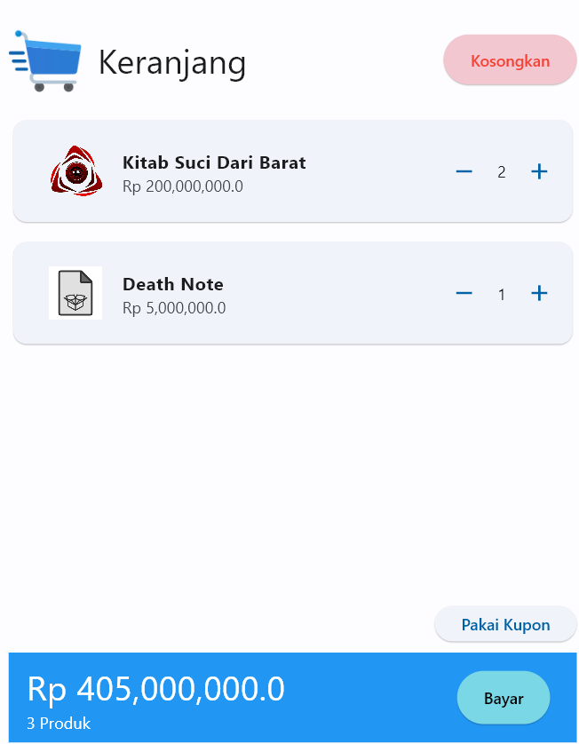

3. Database Controller

Dibagikan kepada: Suthasoma Mahardhika Munthe

Gambar 1: 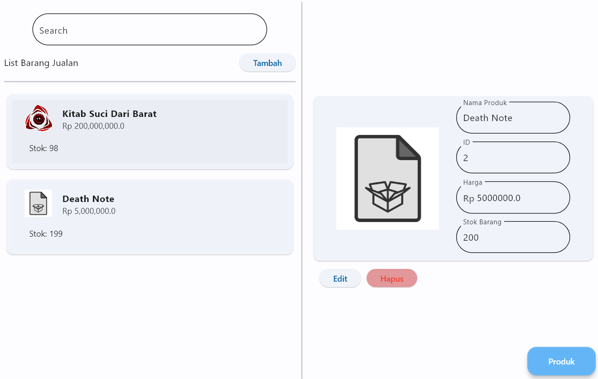

Gambar 2: 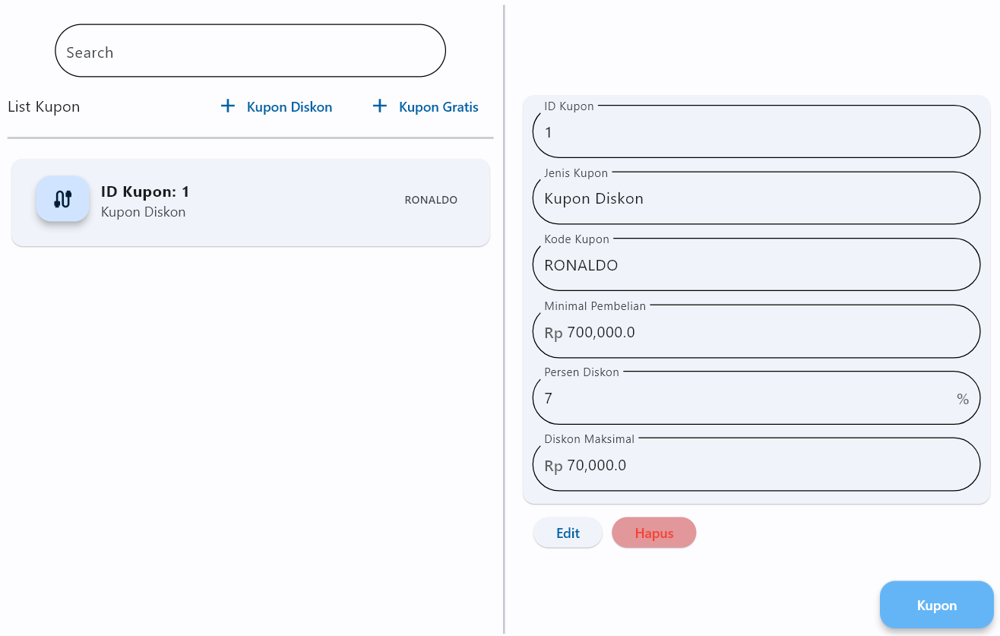

4. Modify Goods and Coupon in the cart

Dibagikan kepada: Benjamin Sihombing, Ibrahim Ihsan Rasyid, Marvin Scifo Y. Hutahaean

Gambar 1: 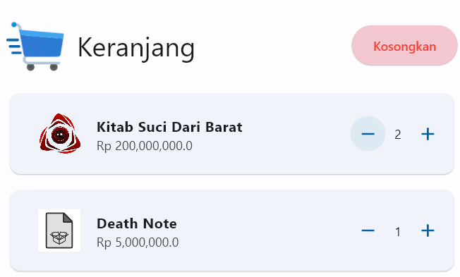

Gambar 2: 

5. View History

Dibagikan kepada: Berto Richardo Togatorop

Gambar: 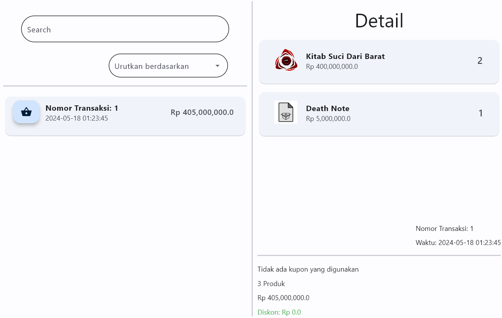

6. Search Goods and Coupons

Dibagikan kepada: Suthasoma Mahardhika Munthe

Gambar 1: 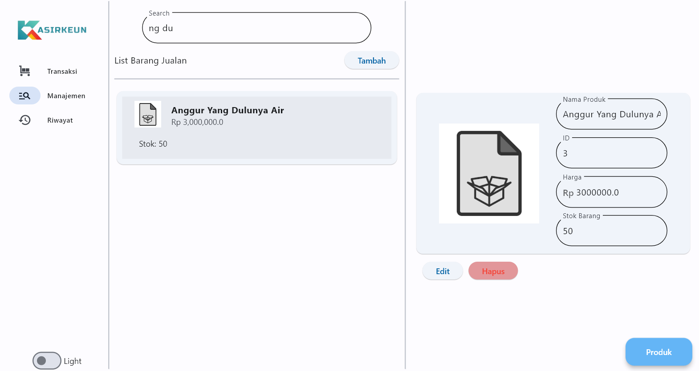

Gambar 2: 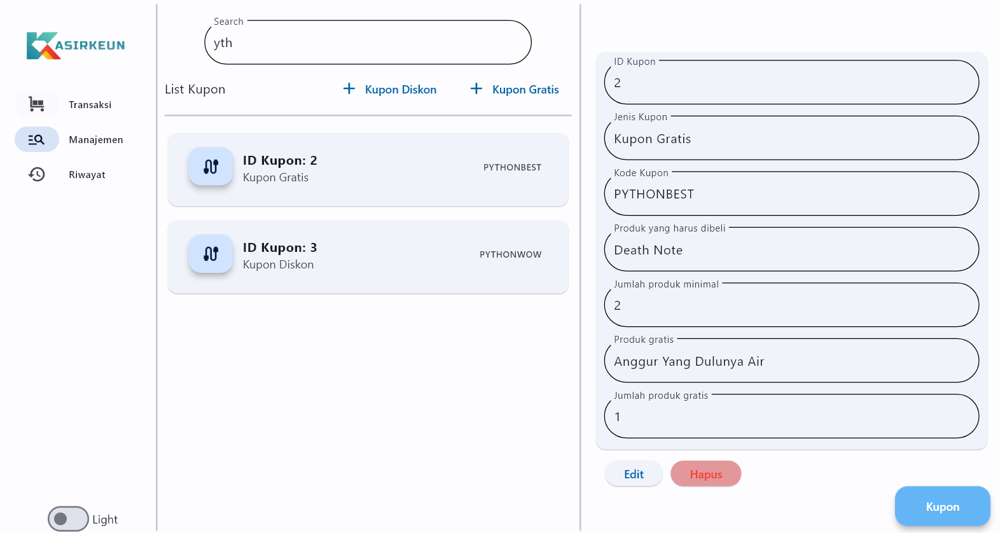


7. Modify Goods and Coupon in the database

Dibagikan kepada: Suthasoma Mahardhika Munthe, Benjamin Sihombing, Ibrahim Ihsan Rasyid, Marvin Scifo Y. Hutahaean

Gambar 1: 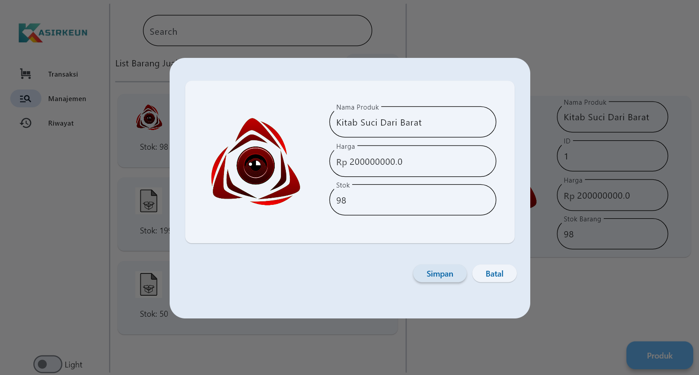

Gambar 2: 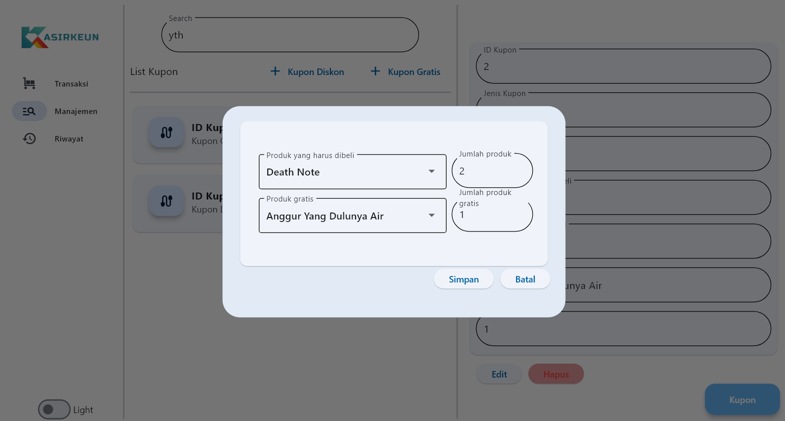

8. View database

Dibagikan kepada: Benjamin Sihombing, Ibrahim Ihsan Rasyid, Marvin Scifo Y. Hutahaean

Gambar 1: 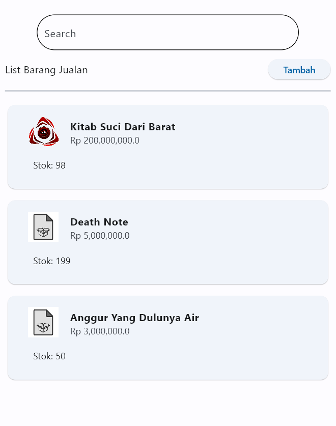

Gambar 2: 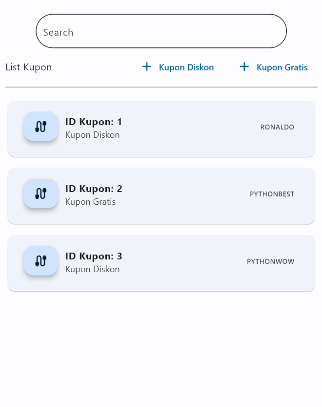

Gambar 3: 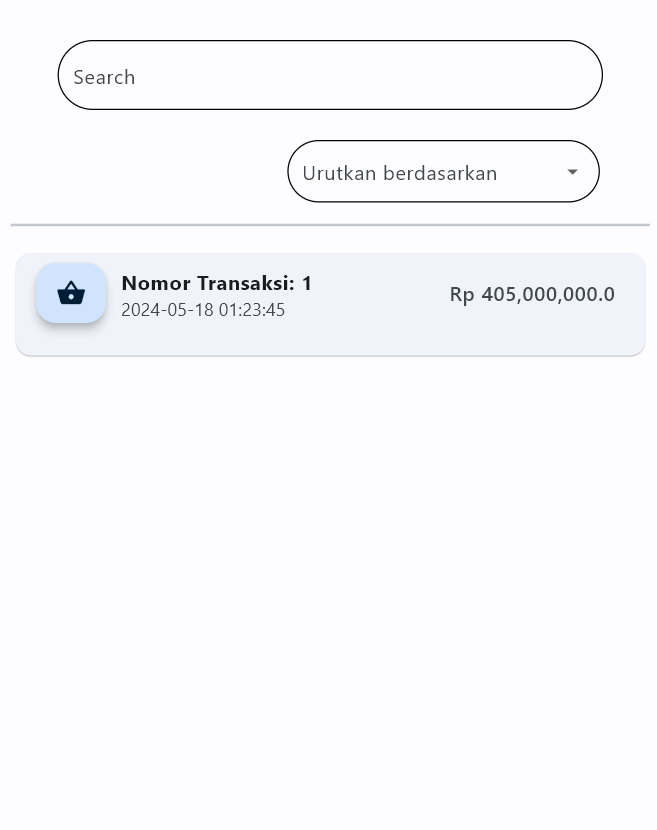

9. Execute transaction

Dibagikan kepada: Suthasoma Mahardhika Munthe, Berto Richardo Togatorop

Gambar: 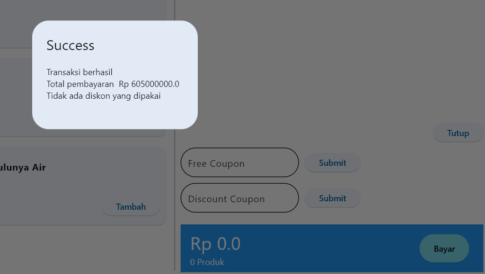

## Database
Database yang digunakan terdapat pada ./src/data/KasirkeunData.db

1. transaction
- id_transaction
- id_free_coupon
- id_discount_coupon
- total_price
- datetime
- discount

2. goods
- id_item
- name
- stock
- price
- img_source

3. sold_goods
- id_transaction
- id_item
- quantity
- prices

4. coupon
- id_coupon
- code
- type

5. free_coupon
- id_coupon
- id_item
- n_item
- id_free
- n_free

6. discount_coupon
- id_coupon
- min_buy
- percentage
- max_discount

## Contributors
1. Ibrahim Ihsan Rasyid - 13522018
2. Benjamin Sihombing - 13522054
3. Suthasoma Mahardhika Munthe - 13522098
4. Marvin Scifo Y. Hutahaean - 13522110
5. Berto Richardo Togatorop - 13522118